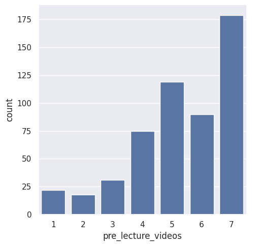
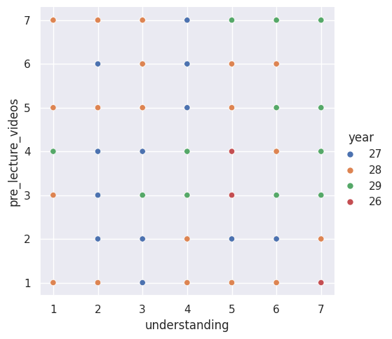
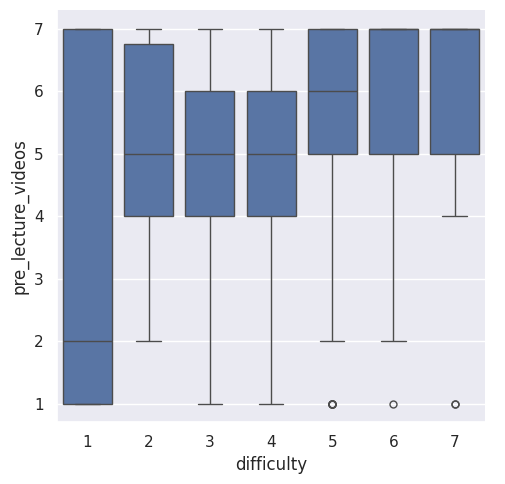

---
# Do not edit the text between these lines!
layout: default
---

# Evaluating The Effectiveness Of Pre-Recorded Lectures

<!-- This is a comment. Below, you'll see code for inserting an image. To make this image appear, update <custom-path>. To add an image, save it inside the imgs folder of this repository. -->

 

## What Does The Data Say?

The data reflects our analysis of student surveys conducted through the use of code and everything that we have learned up until this point in this class. We chose to focus in on perceptions of pre-recorded lectures and their potential use in the following semesters. 

Based on the data and our findings, we argue that COMP 110 should implement more pre-lecture videos to improve the rate at which students learn concepts, and the extent to which they are able to retain knowledge. 

The first bar graph listed shows a strong trend towards the higher numbers on the given 1-7 scale, meaning that there is a collective agreement amongst our peers that pre-recorded lecture videos would be helpful for learning. 

Additionally, the scatterplot revealed that students who had a poor understanding of certain concepts (marked by the x-axis) were very supportive towards these ideas, showing that they feel as if this implementation would help them grasp more concepts. 

The third graph showed that students who do not find the course difficult are still in favor of implementing pre-recorded lecture videos, meaning even they see benefit in regards to knowledge, even if they are excelling in the class already. Not to mention those who find the class extremely difficult are also still in favor, signaling that pre-recorded lectures would benefit them in learning more efficiently.

However, this is not to say that there are not restrictions that exist when it comes to this idea. Creating these videos is a process that takes a lot of time and editing which could cause a burden on the professor, along with TAs. Some students might feel overwhelmed by the extra information due to the recorded lectures on top of the in-person lectures. In order to successfully implement this idea, we recommend testing out the videos for a short period, and deploy a survey to track the effectiveness. This would give us the final data needed to determine if pre-recorded lectures are truly effective and should be implemented by the department.